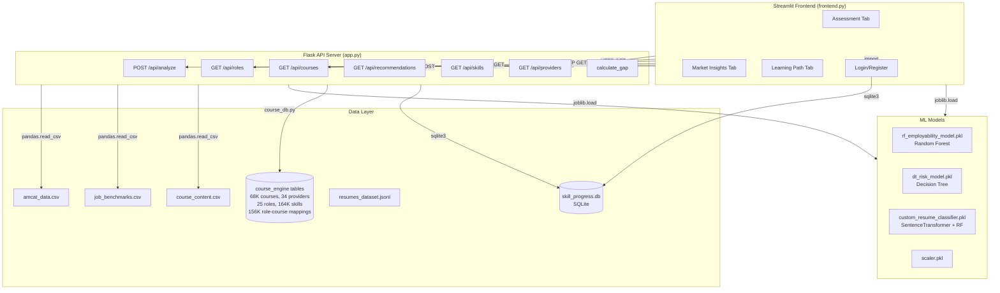
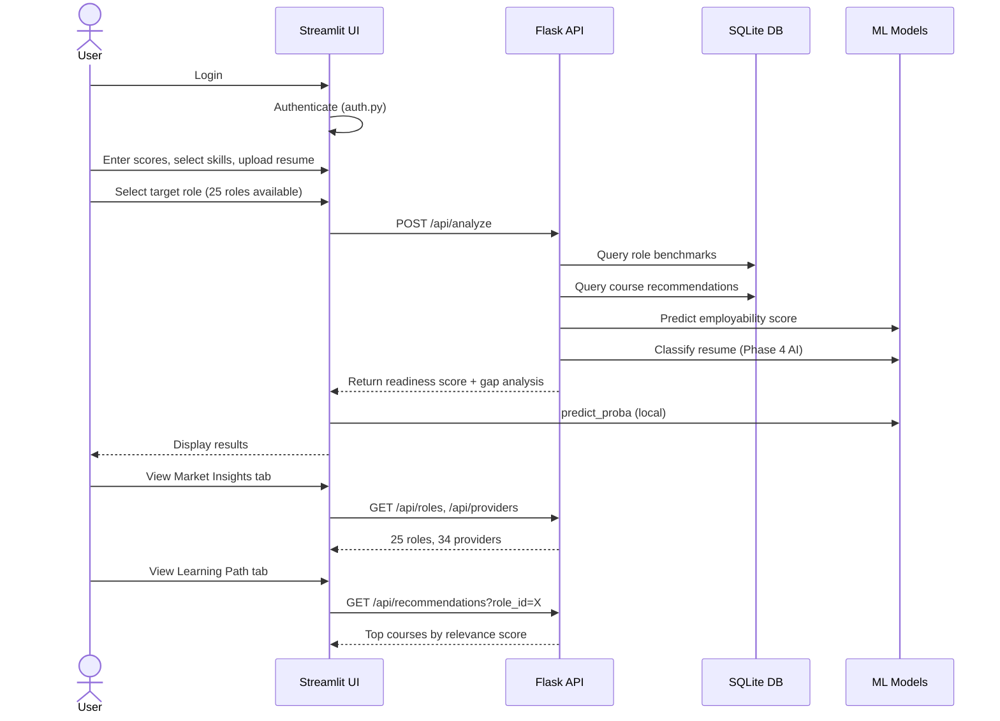
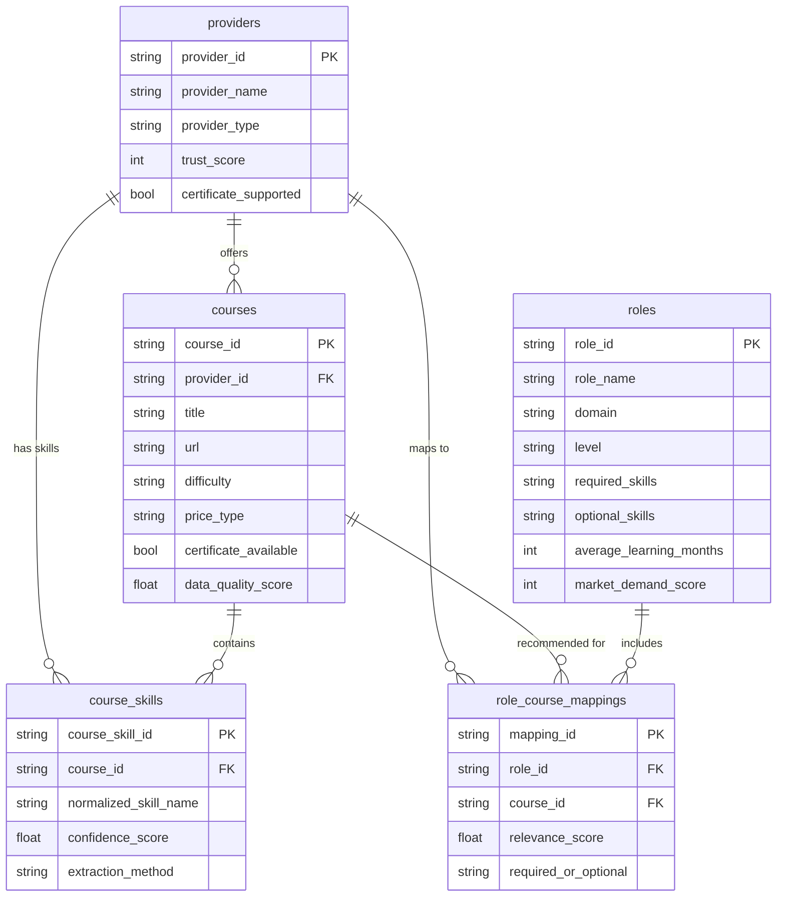

# SkillGap AI Pro

**2026 Market-Ready Employability Analyzer** — An end-to-end skill gap assessment platform powered by machine learning, featuring a 68K+ course engine with 34 providers across 25 tech roles.

---

## Architecture



## Data Flow



## Features

### Assessment Engine
- **5 skill sliders**: Logical Reasoning, Quantitative Aptitude, English & Communication, Programming Logic, Domain Knowledge (100–900 scale)
- **25 target roles** across 5 domains (Software Development, Data, AI/ML, Cyber Security, DevOps)
- **PDF resume upload** with keyword scoring (action verbs, quantified achievements, tech stack)
- **ML-powered employability prediction** (Random Forest, 75%+ accuracy)
- **AI resume classification** (SentenceTransformer + custom Random Forest)
- **Skill gap analysis** with weighted readiness scoring

### Market Insights
- Dynamic role comparison across all 25 roles
- Demand scores, priority scores, learning months
- 34 course providers with trust ratings
- Domain-by-domain breakdown

### Learning Path
- Real course recommendations from 68,640 courses
- Scored by relevance (skill_match, title_match, provider_trust, credential_score)
- Filter by difficulty and certificate availability
- Foundation and Recommended priority levels

## Course Engine Data

| Table | Rows | Description |
|-------|------|-------------|
| `providers` | 34 | NPTEL, Microsoft Learn, MIT OCW, freeCodeCamp, DataCamp, etc. |
| `courses` | 68,641 | Multi-provider, multi-language course catalog |
| `course_skills` | 164,260 | Auto-extracted skill tags from course titles/descriptions |
| `roles` | 25 | Structured tech roles with required/optional skills |
| `role_course_mappings` | 156,755 | Scored course-to-role relevance mappings |



## ML Models

| Model | Algorithm | Trained On | Purpose |
|-------|-----------|-----------|---------|
| `rf_employability_model.pkl` | Random Forest (200 trees) | AMCAT dataset (~4K records) | Predict high-salary employability |
| `scaler.pkl` | StandardScaler | AMCAT features | Feature normalization |
| `dt_risk_model.pkl` | Decision Tree (depth=5) | Student dropout data (~4.4K records) | Predict dropout/graduation risk |
| `custom_resume_classifier.pkl` | Random Forest (100 trees) + SentenceTransformer | 3,500 resumes (JSONL) | Classify resume into job category |

## Quick Start

```bash
# 1. Install dependencies
pip install -r requirements.txt

# 2. Import course engine data
python import_course_data.py

# 3. Start Flask API server
python app.py

# 4. In another terminal, start Streamlit frontend
streamlit run frontend.py

# 5. Open http://localhost:8501 in your browser
```

### Training Models (optional)

```bash
# Train employability model
python train_model.py

# Train dropout risk model
python train_risk_model.py

# Train resume classifier
python train_custom_ai.py
```

## API Reference

| Endpoint | Method | Description |
|----------|--------|-------------|
| `/api/analyze` | POST | Full employability analysis with gap detection |
| `/api/roles` | GET | List all 25 roles (filter by `?domain=AI/ML`) |
| `/api/roles/<id>` | GET | Single role with skills |
| `/api/courses` | GET | Search courses (`?skill=Python&difficulty=beginner`) |
| `/api/courses/<id>` | GET | Single course with associated skills |
| `/api/skills` | GET | List all skills (`?search=Python`) |
| `/api/recommendations` | GET | Role course recommendations (`?role_id=R011`) |
| `/api/providers` | GET | All 34 providers with trust scores |

## Tech Stack

- **Frontend**: Streamlit, PyPDF2, pandas
- **Backend**: Flask, Flask-CORS
- **ML**: scikit-learn, Sentence Transformers, joblib
- **Data**: SQLite, pandas, numpy
- **Auth**: SQLite + SHA-256 hashing

## Project Structure

```
├── app.py                    # Flask API server
├── frontend.py               # Streamlit UI
├── auth.py                   # Authentication module
├── course_db.py              # Course engine query layer
├── import_course_data.py     # Course data import script
├── train_model.py            # Employability model training
├── train_risk_model.py       # Dropout risk model training
├── train_custom_ai.py        # Resume classifier training
├── data/
│   ├── skill_progress.db     # Main database (users + course engine)
│   ├── amcat_data.csv        # AMCAT employability dataset
│   ├── job_benchmarks.csv    # Role skill benchmarks
│   ├── course_content.csv    # Remedial course resources
│   └── students_dropout_academic_success.csv
├── models/
│   ├── rf_employability_model.pkl
│   ├── dt_risk_model.pkl
│   ├── scaler.pkl
│   └── custom_resume_classifier.pkl
└── docs/
    └── presentation/
```
