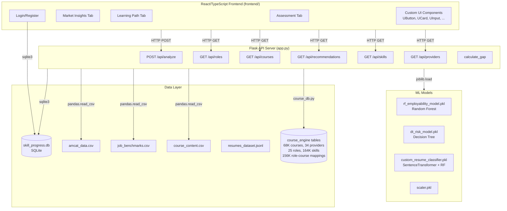
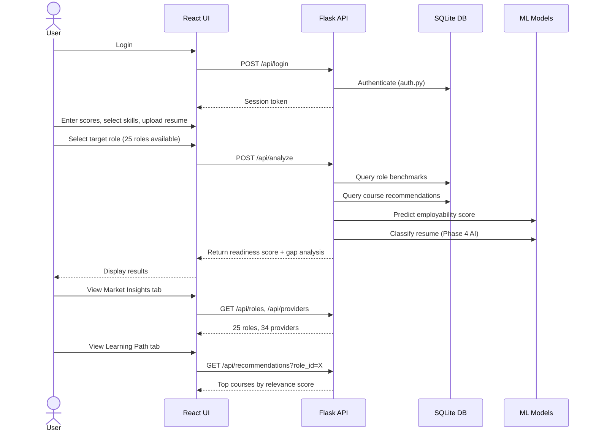
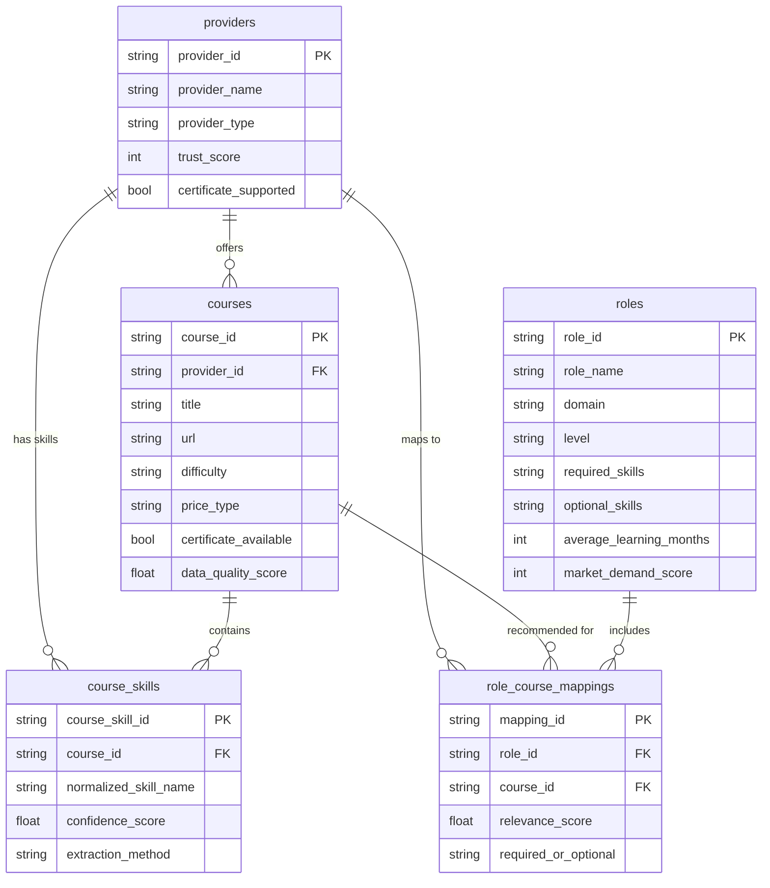

# SkillGap AI Pro

**2026 Market-Ready Employability Analyzer** -- An end-to-end skill gap assessment platform powered by machine learning, featuring a 68K+ course engine with 34 providers across 25 tech roles.

---

## Architecture


```mermaid
graph TB
    subgraph Frontend["React/TypeScript Frontend (frontend/)"]
        A1[Assessment Tab]
        A2[Market Insights Tab]
        A3[Learning Path Tab]
        AUTH[Login/Register]
        UI[Custom UI Components<br/>UButton, UCard, UInput, ...]
    end

    subgraph Backend["Flask API Server (app.py)"]
        B1[POST /api/analyze]
        B2[GET /api/roles]
        B3[GET /api/courses]
        B4[GET /api/recommendations]
        B5[GET /api/skills]
        B6[GET /api/providers]
        GAP[calculate_gap]
    end

    subgraph Models["ML Models"]
        M1[rf_employability_model.pkl<br/>Random Forest]
        M2[dt_risk_model.pkl<br/>Decision Tree]
        M3[custom_resume_classifier.pkl<br/>SentenceTransformer + RF]
        SC[scaler.pkl]
    end

    subgraph Data["Data Layer"]
        D1[(skill_progress.db<br/>SQLite)]
        D2[amcat_data.csv]
        D3[job_benchmarks.csv]
        D4[course_content.csv]
        D5[resumes_dataset.jsonl]
        D6[(course_engine tables<br/>68K courses, 34 providers<br/>25 roles, 164K skills<br/>156K role-course mappings)]
    end

    Frontend -- HTTP POST --> B1
    Frontend -- HTTP GET --> B2 & B3 & B4 & B5 & B6
    Backend -- pandas.read_csv --> D2 & D3 & D4
    Backend -- joblib.load --> Models
    Backend -- course_db.py --> D6
    Backend -- sqlite3 --> D1
    AUTH -- sqlite3 --> D1
```

## Data Flow


```mermaid
sequenceDiagram
    actor User
    participant UI as React UI
    participant API as Flask API
    participant DB as SQLite DB
    participant ML as ML Models

    User->>UI: Login
    UI->>API: POST /api/login
    API->>DB: Authenticate (auth.py)
    API-->>UI: Session token

    User->>UI: Enter scores, select skills, upload resume
    User->>UI: Select target role (25 roles available)

    UI->>API: POST /api/analyze
    API->>DB: Query role benchmarks
    API->>DB: Query course recommendations
    API->>ML: Predict employability score
    API->>ML: Classify resume (Phase 4 AI)
    API-->>UI: Return readiness score + gap analysis

    UI-->>User: Display results

    User->>UI: View Market Insights tab
    UI->>API: GET /api/roles, /api/providers
    API-->>UI: 25 roles, 34 providers

    User->>UI: View Learning Path tab
    UI->>API: GET /api/recommendations?role_id=X
    API-->>UI: Top courses by relevance score
```

## Features

### Assessment Engine
- **5 skill sliders**: Logical Reasoning, Quantitative Aptitude, English & Communication, Programming Logic, Domain Knowledge (100-900 scale)
- **25 target roles** across 5 domains (Software Development, Data, AI/ML, Cyber Security, DevOps)
- **PDF resume upload** with keyword scoring (action verbs, quantified achievements, tech stack)
- **ML-powered employability prediction** (Random Forest, 75%+ accuracy)
- **AI resume classification** (SentenceTransformer + custom Random Forest)
- **Skill gap analysis** with weighted readiness scoring

### Market Insights
- Dynamic role comparison across all 25 roles
- Demand scores, priority scores, learning months
- 34 course providers with trust ratings
- Domain-by-domain breakdown

### Learning Path
- Real course recommendations from 68,640 courses
- Scored by relevance (skill_match, title_match, provider_trust, credential_score)
- Filter by difficulty and certificate availability
- Foundation and Recommended priority levels

## Course Engine Data

| Table | Rows | Description |
|-------|------|-------------|
| `providers` | 34 | NPTEL, Microsoft Learn, MIT OCW, freeCodeCamp, DataCamp, etc. |
| `courses` | 68,641 | Multi-provider, multi-language course catalog |
| `course_skills` | 164,260 | Auto-extracted skill tags from course titles/descriptions |
| `roles` | 25 | Structured tech roles with required/optional skills |
| `role_course_mappings` | 156,755 | Scored course-to-role relevance mappings |


```mermaid
erDiagram
    providers ||--o{ courses : offers
    providers ||--o{ course_skills : "has skills"
    providers ||--o{ role_course_mappings : "maps to"
    courses ||--o{ course_skills : contains
    courses ||--o{ role_course_mappings : "recommended for"
    roles ||--o{ role_course_mappings : includes

    providers {
        string provider_id PK
        string provider_name
        string provider_type
        int trust_score
        bool certificate_supported
    }

    courses {
        string course_id PK
        string provider_id FK
        string title
        string url
        string difficulty
        string price_type
        bool certificate_available
        float data_quality_score
    }

    course_skills {
        string course_skill_id PK
        string course_id FK
        string normalized_skill_name
        float confidence_score
        string extraction_method
    }

    roles {
        string role_id PK
        string role_name
        string domain
        string level
        string required_skills
        string optional_skills
        int average_learning_months
        int market_demand_score
    }

    role_course_mappings {
        string mapping_id PK
        string role_id FK
        string course_id FK
        float relevance_score
        string required_or_optional
    }
```

## ML Models

| Model | Algorithm | Trained On | Purpose |
|-------|-----------|-----------|---------|
| `rf_employability_model.pkl` | Random Forest (200 trees) | AMCAT dataset (~4K records) | Predict high-salary employability |
| `scaler.pkl` | StandardScaler | AMCAT features | Feature normalization |
| `dt_risk_model.pkl` | Decision Tree (depth=5) | Student dropout data (~4.4K records) | Predict dropout/graduation risk |
| `custom_resume_classifier.pkl` | Random Forest (100 trees) + SentenceTransformer | 3,500 resumes (JSONL) | Classify resume into job category |

## Quick Start

### Start the application

```bash
# 1. Import course engine data (one-time setup)
python import_course_data.py

# 2. Start Flask server (serves both API + React frontend)
python app.py

# 3. Open http://localhost:5000 in your browser
```

### Start with batch files (Windows)

Double-click `start_backend.bat` to launch the Flask server, then open `http://localhost:5000`.

### Development mode (React hot-reload)

```bash
cd frontend
npm install
npm run dev        # Vite dev server on port 8501
# In another terminal:
python ../app.py   # Flask API on port 5000
# Open http://localhost:8501 (Vite proxies /api to Flask)
```

### Training Models (optional)

```bash
# Train employability model
python train_model.py

# Train dropout risk model
python train_risk_model.py

# Train resume classifier
python train_custom_ai.py
```

## API Reference

| Endpoint | Method | Description |
|----------|--------|-------------|
| `/api/analyze` | POST | Full employability analysis with gap detection |
| `/api/roles` | GET | List all 25 roles (filter by `?domain=AI/ML`) |
| `/api/roles/<id>` | GET | Single role with skills |
| `/api/courses` | GET | Search courses (`?skill=Python&difficulty=beginner`) |
| `/api/courses/<id>` | GET | Single course with associated skills |
| `/api/skills` | GET | List all skills (`?search=Python`) |
| `/api/recommendations` | GET | Role course recommendations (`?role_id=R011`) |
| `/api/providers` | GET | All 34 providers with trust scores |

## Tech Stack

- **Frontend**: React 19, TypeScript, Vite 6, Tailwind CSS v4
- **Backend**: Flask, Flask-CORS
- **ML**: scikit-learn, Sentence Transformers, joblib
- **Data**: SQLite, pandas, numpy
- **Auth**: SQLite + SHA-256 hashing

## Project Structure

```
├── app.py                        # Flask API server (serves API + React build)
├── auth.py                       # Authentication module
├── course_db.py                  # Course engine query layer
├── import_course_data.py         # Course data import script
├── train_model.py                # Employability model training
├── train_risk_model.py           # Dropout risk model training
├── train_custom_ai.py            # Resume classifier training
├── start_backend.bat             # Windows batch: start Flask server
├── start_frontend.bat            # Windows batch: start Vite dev server
├── frontend/
│   ├── index.html                # Entry HTML
│   ├── vite.config.ts            # Vite config (port 8501, /api proxy)
│   ├── package.json              # Dependencies
│   ├── dist/                     # Production build (served by Flask)
│   └── src/
│       ├── main.tsx              # React entry point
│       ├── App.tsx               # Main app with auth + tab routing
│       ├── index.css             # Tailwind v4 + custom utilities + animations
│       ├── types/index.ts        # TypeScript interfaces
│       ├── api/client.ts         # API client (fetch wrapper)
│       ├── context/
│       │   ├── AuthContext.tsx    # Auth state management
│       │   └── NotificationContext.tsx  # Toast notifications
│       ├── hooks/
│       │   ├── useAsync.ts       # Generic async state hook
│       │   └── useForm.ts        # Form validation hook
│       ├── components/
│       │   ├── LoginPage.tsx     # Landing page + auth modal
│       │   ├── Assessment.tsx    # Skill assessment tab
│       │   ├── MarketInsights.tsx # Market data tab
│       │   ├── LearningPath.tsx  # Course recommendations tab
│       │   └── ui/              # 14 custom UI components
│       │       ├── UButton.tsx, UCard.tsx, UInput.tsx, ...
│       │       ├── UCheckbox.tsx, URadio.tsx, UToggle.tsx
│       │       ├── ULoader.tsx, USkeleton.tsx, USelect.tsx
│       │       ├── USlider.tsx, UBadge.tsx, UNotification.tsx
│       │       ├── UProgressBar.tsx, UAccordion.tsx
│       │       └── index.ts      # Barrel exports
│       └── ...
├── data/
│   ├── skill_progress.db         # Main database (users + course engine)
│   ├── amcat_data.csv            # AMCAT employability dataset
│   ├── job_benchmarks.csv        # Role skill benchmarks
│   ├── course_content.csv        # Remedial course resources
│   └── students_dropout_academic_success.csv
├── models/
│   ├── rf_employability_model.pkl
│   ├── dt_risk_model.pkl
│   ├── scaler.pkl
│   └── custom_resume_classifier.pkl
└── docs/
    └── presentation/
```

## Deployment

### Production (single process)

```bash
python app.py
# Open http://localhost:5000 (Flask serves React build + all API routes)
```

### Colab Notebook

`SkillGapAI_Colab_Deploy.ipynb` provides an 11-cell deployment workflow:
1. Mount Google Drive
2. Clone repository
3. Install Python + Node.js dependencies
4. Build React frontend
5. Setup database (download from URL or upload manually)
6. Start Flask backend (port 5000, serves both API + frontend)
7. (Optional) ngrok tunnel for public access
8. Test with sample data
9. Stop all processes

### Vite Dev Mode (hot-reload)

Use `start_frontend.bat` or `npm run dev` from `frontend/` for development with hot module replacement. Vite proxies `/api` requests to Flask on port 5000.

## Notes

- `data/skill_progress.db` (140 MB) is excluded from git via `.gitignore`. For deployment, use Git LFS or download from a release artifact.
- The correct Python interpreter is `C:\Users\bakke\AppData\Local\Programs\Python\Python311\python.exe` (has Flask + scikit-learn 1.3.2).
- The default `python` on PATH is the hermes-agent venv and lacks Flask.
